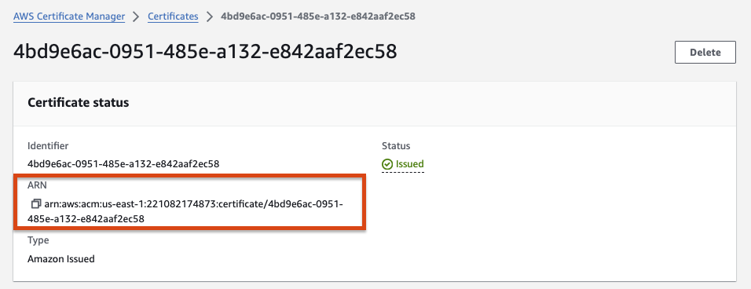
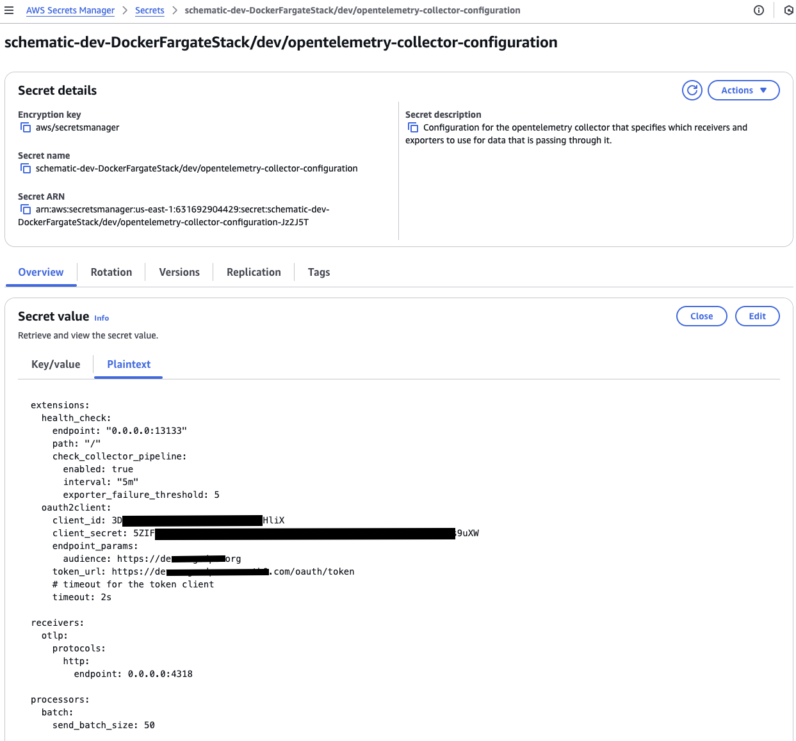
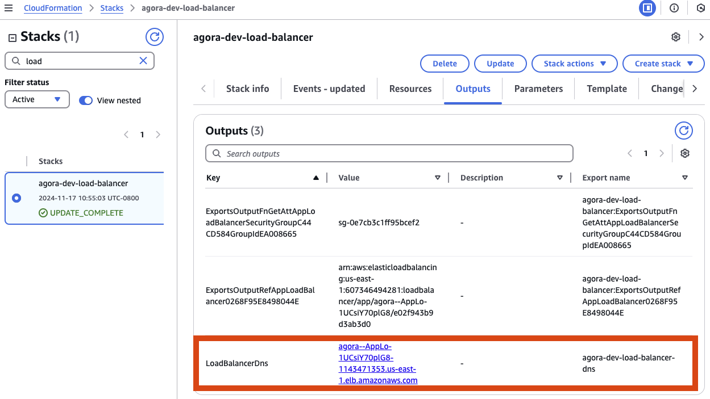
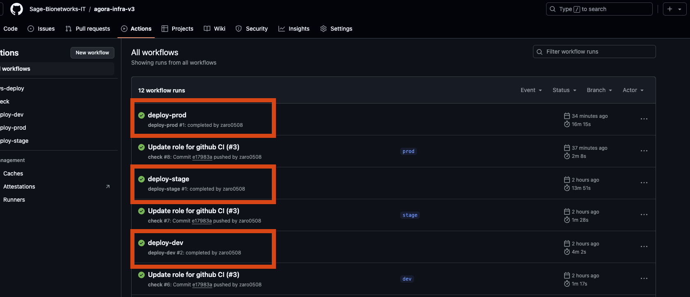
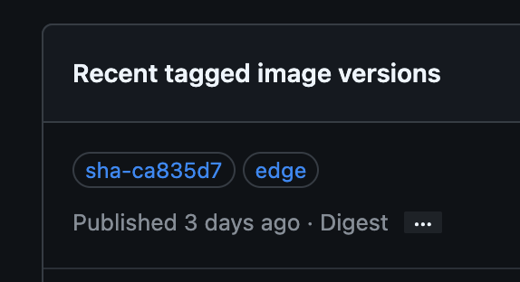
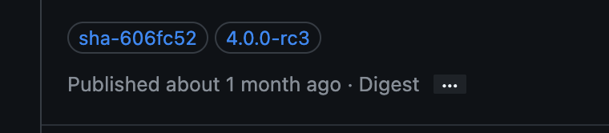

# AWS CDK app

A Github template using the AWS CDK to create an ECS infrastructure project for deploying Model-AD.

# Prerequisites

AWS CDK projects require some bootstrapping before synthesis or deployment.
Please review the [bootstapping documentation](https://docs.aws.amazon.com/cdk/v2/guide/getting_started.html#getting_started_bootstrap)
before development.

> [!Note]
> Sage IT deploys this CDK bootstrap upon creation of every AWS account in our AWS Organization.

# Dev Container

This repository provides a [dev container](https://containers.dev/) that includes all the tools
required to develop this AWS CDK app.

## Opening the project inside its dev container

With VS Code:

1. Clone this repo
2. File > Open Folder...
3. A prompt should invite you to open the project inside the dev container. If not, open VS Code
    Command Palette and select "Dev Containers: Open Folder in Container..."

With GitHub Codespaces:

1. From the main page of this repository, click on the button "Code" > Codespaces > Click on the
   button "Create codespace"

That's it! You are now inside the dev container and have access to all the development tools.

# Development

All the development tools are provided when developing inside the dev container
(see above). These tools include Python, AWS CLI, AWS CDK CLI, etc. These tools
also include a Python virtual environment where all the Python packages needed
are already installed.

If you decide the develop outside of the dev container, some of the development
tools can be installed by running:

```console
./tools/setup.sh
```

Development requires the activation of the Python virtual environment:

```
$ source .venv/bin/activate
```

At this point you can now synthesize the CloudFormation template for this code.

```
$ cdk synth
```

To add additional dependencies, for example other CDK libraries, just add
them to your `setup.py` file and rerun the `pip install -r requirements.txt`
command.

## Useful commands

 * `cdk ls`          list all stacks in the app
 * `cdk synth`       emits the synthesized CloudFormation template
 * `cdk deploy`      deploy this stack to your default AWS account/region
 * `cdk diff`        compare deployed stack with current state
 * `cdk docs`        open CDK documentation


# Testing

## Static Analysis

As a pre-deployment step we syntactically validate the CDK json, yaml and
python files with [pre-commit](https://pre-commit.com).

Please install pre-commit, once installed the file validations will
automatically run on every commit.  Alternatively you can manually
execute the validations by running `pre-commit run --all-files`.

Create a [GitHub classic personal access token](https://docs.github.com/en/authentication/keeping-your-account-and-data-secure/managing-your-personal-access-tokens#creating-a-personal-access-token-classic) with `read:packages` access, then create a .env file using .env.example as a template. The token is used to authenticate with the GitHub API and access the packages endpoint to look up the latest image version for each service.

Verify CDK to Cloudformation conversion by running [cdk synth]:

```console
env $(cat .env | xargs) cdk synth
```

The Cloudformation output is saved to the `cdk.out` folder

## Unit Tests

Tests are available in the tests folder. Execute the following to run tests:

```
python -m pytest tests/ -s -v
```


## Environments

An `ENV` environment variable must be set when running the `cdk` command tell the
CDK which environment's variables to use when synthesising or deploying the stacks.

Set environment variables for each environment in the [app.py](./app.py) file:

```python
environment_variables = {
    "VPC_CIDR": "10.254.192.0/24",
    "FQDN": "dev.app.io",
    "CERTIFICATE_ID": "0e9682f6-3ffa-46fb-9671-b6349f5164d6",
    "TAGS": {"CostCenter": "NO PROGRAM / 000000"},
}
```

For example, synthesis with the `prod` environment variables:

```console
ENV=prod cdk synth
```

> [!NOTE]
> The `VPC_CIDR` must be a unique value within our AWS organization. Check our
> [wiki](https://sagebionetworks.jira.com/wiki/spaces/IT/pages/2850586648/Setup+AWS+VPC)
> for information on how to obtain a unique CIDR

## Certificates

Certificates to set up HTTPS connections should be created manually in AWS certificate manager.
This is not automated due to AWS requiring manual verification of the domain ownership.
Once created take the ARN of the certificate and set that ARN in environment_variables.



## Secrets

Secrets can be manually created in the
[AWS Secrets Manager](https://docs.aws.amazon.com/secretsmanager/latest/userguide/create_secret.html).
When naming your secret make sure that the secret does not end in a pattern that matches
`-??????`, this will cause issues with how AWS CDK looks up secrets.

To pass secrets to a container set the secrets manager `container_secrets`
when creating a `ServiceProp` object. You'll be creating a list of `ServiceSecret` objects:
```python
from src.service_props import ServiceProps, ServiceSecret

app_service_props = ServiceProps(
    container_name="app",
    container_port=443,
    container_memory_reservation=1024,
    container_location="ghcr.io/sage-bionetworks/app:v1.0",
    container_secrets=[
        ServiceSecret(
            secret_name="app/dev/DATABASE",
            environment_key="NAME_OF_ENVIRONMENT_VARIABLE_SET_FOR_CONTAINER",
        ),
        ServiceSecret(
            secret_name="app/dev/PASSWORD",
            environment_key="SINGLE_VALUE_SECRET",
        )
    ]
)
```

For example, the KVs for `app/dev/DATABASE` could be:
```json
{
    "DATABASE_USER": "maria",
    "DATABASE_PASSWORD": "password"
}
```

And the value for `app/dev/PASSWORD` could be: `password`

In the application (Python) code the secrets may be loaded into a dict using code like:

```python
import json
import os

all_secrets_dict = json.loads(os.environ["NAME_OF_ENVIRONMENT_VARIABLE_SET_FOR_CONTAINER"])
```

In the case of a single value you may load the value like:

```python
import os

my_secret = os.environ.get("SINGLE_VALUE_SECRET", None)
```


> [!NOTE]
> Retrieving secrets requires access to the AWS Secrets Manager

## DNS

A DNS CNAME must be created in org-formation after the initial
deployment of the application to make the application available at the desired
URL. The CDK application exports the DNS name of the Application Load Balancer
to be consumed in org-formation. [An example PR setting up a CNAME](https://github.com/Sage-Bionetworks-IT/organizations-infra/pull/1299).

Login to the AWS cloudformation console and navigate to the deployed stack `app-load-balancer`
and click on the `Outputs` tab.  On the row whose key is `LoadBalancerDNS` look for the
value in the `Export Name` column, e.g., `app-dev-load-balancer-dns`.


Now use the name in the `TargetHostName` definition, for example:

```
TargetHostName: !CopyValue [!Sub 'app-dev-load-balancer-dns', !Ref DnTDevAccount]
```

(You would also replace `DnTDevAccount` with the name of the account in which the application is deployed.)

> [!NOTE]
> Setting up the DNS cname should be done at the very end of this infra setup


## Debugging

Generally CDK deployments will create cloudformation events during a CDK deploy.
The events can be viewed in the AWS console under the cloudformation service page.
Viewing those events will help with errors during a deployment.  Below are cases
where it might be difficult to debug due to misleading or insufficient error
messages from AWS

### Missing Secrets

Each new environment (dev/staging/prod/etc..) may require adding secrets.  If a
secret is not created for the environment you may get an error with the following
stack trace..
```
Resource handler returned message: "Error occurred during operation 'ECS Deployment Circuit Breaker was triggered'." (RequestToken: d180e115-ba94-d8a2-acf9-abe17a3aaed9, HandlerErrorCode: GeneralServiceException)
    new BaseService (/private/var/folders/qr/ztb40vmn2pncyh8jpsgfnrt40000gp/T/jsii-kernel-4PEWmj/node_modules/aws-cdk-lib/aws-ecs/lib/base/base-service.js:1:3583)
    \_ new FargateService (/private/var/folders/qr/ztb40vmn2pncyh8jpsgfnrt40000gp/T/jsii-kernel-4PEWmj/node_modules/aws-cdk-lib/aws-ecs/lib/fargate/fargate-service.js:1:967)
    \_ new ApplicationLoadBalancedFargateService (/private/var/folders/qr/ztb40vmn2pncyh8jpsgfnrt40000gp/T/jsii-kernel-4PEWmj/node_modules/aws-cdk-lib/aws-ecs-patterns/lib/fargate/application-load-balanced-fargate-service.js:1:2300)
    \_ Kernel._create (/private/var/folders/qr/ztb40vmn2pncyh8jpsgfnrt40000gp/T/tmpqkmckdm2/lib/program.js:9964:29)
    \_ Kernel.create (/private/var/folders/qr/ztb40vmn2pncyh8jpsgfnrt40000gp/T/tmpqkmckdm2/lib/program.js:9693:29)
    \_ KernelHost.processRequest (/private/var/folders/qr/ztb40vmn2pncyh8jpsgfnrt40000gp/T/tmpqkmckdm2/lib/program.js:11544:36)
    \_ KernelHost.run (/private/var/folders/qr/ztb40vmn2pncyh8jpsgfnrt40000gp/T/tmpqkmckdm2/lib/program.js:11504:22)
    \_ Immediate._onImmediate (/private/var/folders/qr/ztb40vmn2pncyh8jpsgfnrt40000gp/T/tmpqkmckdm2/lib/program.js:11505:46)
    \_ processImmediate (node:internal/timers:464:21)
```

# Deployment

## Bootstrap

There are a few items that need to be manually bootstrapped before deploying the application.

* Add secrets to the AWS Secrets Manager
* Create an [ACM certificate for the application](#Certificates) using the AWS Certificates Manager
* Update environment_variables in [app.py](app.py) with variable specific to each environment.
* Update references to the docker images in [app.py](app.py)
  (i.e. `ghcr.io/sage-bionetworks/app-xxx:<tag>`)
* (Optional) Update the `ServiceProps` objects in [app.py](app.py) with parameters specific to
  each container.

## Login with the AWS CLI

> [!NOTE]
> This and the following sections assume that you are working in the AWS account
> `org-sagebase-itsandbox` with the role `Developer` and that you are deploying
> to the `us-east-1` region. If this assumption is correct, you should be able
> to simply copy-paste the following commands, otherwise adapting the
> configuration should be straightforward.

Create the config file if it doesn't exist yet.

```console
mkdir ~/.aws && touch ~/.aws/config
```

As a Developer working in Sage IT Sandbox AWS account, add the following profile to the config file.

```ini
[profile itsandbox-dev]
sso_start_url = https://d-906769aa66.awsapps.com/start
sso_region = us-east-1
sso_account_id = XXXXXXXXX
sso_role_name = Developer
```

Login with the AWS CLI:

```console
aws --profile itsandbox-dev sso login
```


## Deploy

Deployment requires setting up an [AWS profile](https://docs.aws.amazon.com/cli/latest/userguide/getting-started-quickstart.html)
then executing the following command:

```console
env $(cat .env | xargs) AWS_PROFILE=itsandbox-dev AWS_DEFAULT_REGION=us-east-1 cdk deploy --all
```

## Force new deployment

```console
AWS_PROFILE=itsandbox-dev AWS_DEFAULT_REGION=us-east-1 aws ecs update-service \
  --cluster <cluster-name> \
  --service <service-name> \
  --force-new-deployment
```

# Execute a command from a container running on ECS

Once a container has been deployed successfully it is accessible for debugging using the
[ECS execute-command](https://docs.aws.amazon.com/cli/latest/reference/ecs/execute-command.html)

Example to get an interactive shell run into a container:

```console
AWS_PROFILE=itsandbox-dev AWS_DEFAULT_REGION=us-east-1 aws ecs execute-command \
  --cluster AppEcs-ClusterEB0386A7-BygXkQgSvdjY \
  --task a2916461f65747f390fd3e29f1b387d8 \
  --container app-mariadb \
  --command "/bin/sh" --interactive
```

# CI Workflow

This repo has been set up to use Github Actions CI to continuously deploy the application.

The workflow for continuous integration:

* Create PR from the git dev branch
* PR is reviewed and approved
* PR is merged
* CI deploys changes to the dev environment (dev.app.io) in the AWS dev account.
* Changes are promoted (or merged) to the git stage branch.
* CI deploys changes to the staging environment (stage.app.io) in the AWS prod account.
* Changes are promoted (or merged) to the git prod branch.
* CI deploys changes to the prod environment (prod.app.io) in the AWS prod account.



# Explorer Deployment Process

## Overview

The source code for the application lives in the [sage-monorepo](https://github.com/Sage-Bionetworks/sage-monorepo). When a new git tag is added in the monorepo, images are published to [GHCR](https://github.com/orgs/Sage-Bionetworks/packages?tab=packages&q=model-ad). These images are deployed with GHA to AWS Fargate using infrastructure code in this repo.

### Dev

|  |
| :---: |
| Tags on latest image published by sage-monorepo |

The development environment was created so that we can redeploy easily. Whenever code in the sage-monorepo is merged after PR was reviewed and all checks approved, a GHA job publishes new images tagged with `edge` and the commit SHA for each service in the stack that changed (e.g. see screenshot of [agora-app package](https://github.com/sage-bionetworks/sage-monorepo/pkgs/container/agora-app) above). The dev infra stack points at the `edge` image tag. So we can rerun the latest `deploy-dev` GHA job to redeploy the latest app code, by looking up the SHA of the most recent image using the `edge` tag and the GitHub API.

So, the footer of the dev site will only show the image tag of the `model-ad-app` package, which in this case is the commit SHA.

### Stage/Prod

|  |
| :---: |
| git tag on image published by sage-monorepo |

Stage and prod environments point at a specific git tag that is manually added. As described below, when a new git tag is manually created for this app in the sage-monorepo, a GHA job publishes new images tagged with that git tag (see screenshot above). Then, the stage or prod environment variavles in the infra repo can be updated to point at that tag. When the changes are merged to the `stage` or `prod` branch, a GHA job will run the `deploy-stage` or `deploy-prod` job accordingly, which will deploy the images tagged with the git tag.

## Dev Deployment

1. When a PR that affects this app is merged to `main` in the sage-monorepo, wait for the [ci job](https://github.com/Sage-Bionetworks/sage-monorepo/actions/workflows/ci.yml) to finish building and publishing images for the affected projects to GHCR.
2. Rerun the last [deploy-dev job](https://github.com/Sage-Bionetworks-IT/modeladexplorer-infra/actions/workflows/deploy-dev.yaml) and wait for the job to successfully update dev deployment. Deployment can be monitored in AWS console in AWS ECS.
3. Confirm that [dev site](https://modeladexplorer-dev.org/) shows changes from last merged PR.

## Staging Deployment

1. Review the list of existing tags [here](https://github.com/Sage-Bionetworks/sage-monorepo/tags). Identify the next `model-ad` tag. For example, if the last `model-ad` tag is `model-ad/v4.0.0-rc2`, then the next tag will be `model-ad/v4.0.0-rc3`. If the last `model-ad` tag doesn’t have a release candidate suffix (e.g. `model-ad/v4.0.0`), then the next tag will be the first release candidate of a new version (e.g. `model-ad/v4.0.1-rc1`). This follows the convention found at [semver.org](https://semver.org/).
2. Create a new git tag in the sage-monorepo:
   - Open devcontainer
   - Checkout the main branch: `git checkout main`
   - Fetch latest changes: `git fetch upstream`
   - Rebase: `git rebase upstream/main`
   - Tag the commit: `git tag model-ad/v4.0.0-rc3`
   - Push the tag: `git push upstream tag model-ad/v4.0.0-rc3`
3. Wait for sage-monorepo [release GHA job](https://github.com/Sage-Bionetworks/sage-monorepo/actions/workflows/release.yml) to successfully build, tag, and push images to GHCR.
4. Create PR in this repo **to the dev branch** that sets `EXPLORER_VERSION` for stage and prod environments to the new version number in `app.py`, since the images are only tagged with the version number (e.g. `4.0.0-rc3`) rather than the full tag name (e.g. `model-ad/v4.0.0-rc3` ).
5. Merge PR. Wait for [deploy-dev job](https://github.com/Sage-Bionetworks-IT/modeladexplorer-infra/actions/workflows/deploy-dev.yaml) to successfully update dev deployment. Deployment can be monitored in AWS console in AWS ECS.
6. Create PR in this repo **to merge dev into the stage branch**.
7. Merge PR. Wait for [deploy-stage GHA job](https://github.com/Sage-Bionetworks-IT/modeladexplorer-v3/actions/workflows/deploy-stage.yaml) to successfully update staging deployment. Deployment can be monitored in AWS console in AWS ECS.
8. Confirm that [staging site](http://modeladexplorer-stage.org/) shows new version’s tag in the app footer.

## Production Deployment

1. Go to the staging site and note the tag in the app footer. Identify the `model-ad` release tag. For example, if the staging site tag is `model-ad/v4.0.0-rc3`, then the release version will be `model-ad/release/v4.0.0`.
2. Create a new git tag in the sage-monorepo:
   - Open devcontainer
   - Checkout the main branch: `git checkout main`
   - Fetch latest changes: `git fetch upstream`
   - Rebase: `git rebase upstream/main`
   - Tag the commit: `git tag model-ad/release/v4.0.0`
   - Push the tag: `git push upstream tag model-ad/release/v4.0.0`
3. Create a PR in this repo **to merge the stage branch into the prod branch**.
4. Merge PR. Wait for the [deploy-prod GHA job](https://github.com/Sage-Bionetworks-IT/modeladexplorer-v3/actions/workflows/deploy-prod.yaml) to successfully update prod deployment. Deployment can be monitored in AWS console in AWS ECS.
5. Confirm that [production site](http://modeladexplorer-prod.org/) shows the same tag in the app footer as the staging site.
